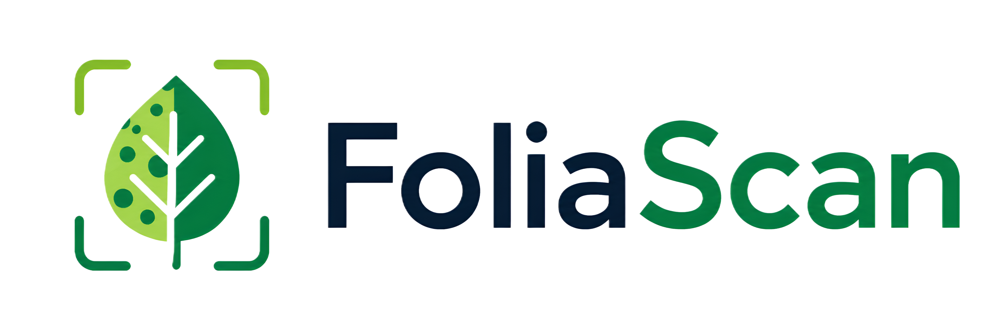
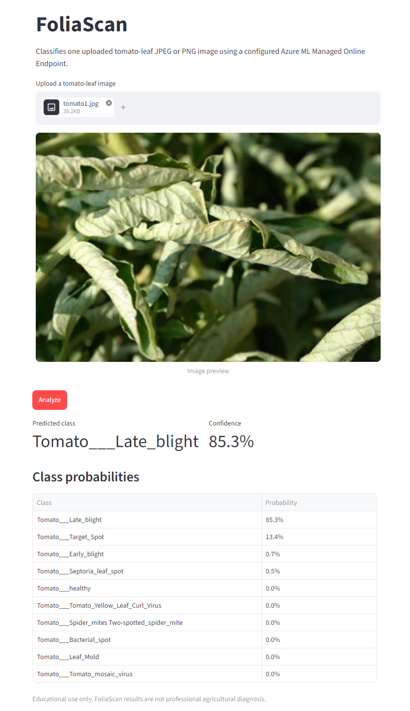
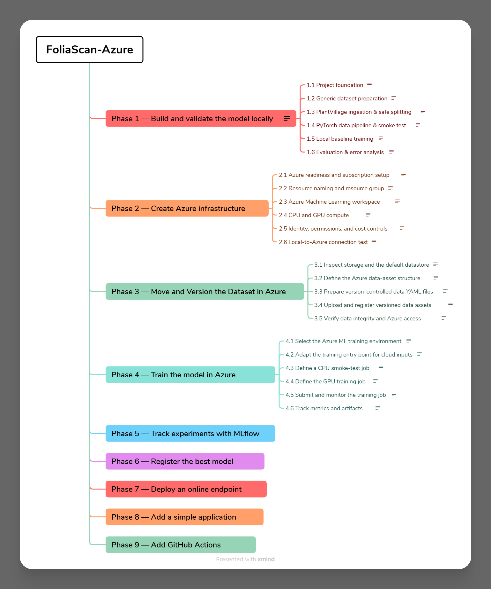

<p align="center">
  
</p>

<p align="center">
  <a href="https://github.com/pegahsalehi/foliascan-azure/actions/workflows/ci.yml">
    
  </a>
</p>

FoliaScan is a tomato-leaf image classification project built to explore an end-to-end computer vision workflow with Azure Machine Learning.

It covers data preparation, PyTorch training, experiment tracking with MLflow, model registration, online inference, a Streamlit client, and automated CI.

<p align="center">
  
</p>

## Highlights

- Leakage-safe preparation of the PlantVillage Tomato dataset
- ResNet18 training and evaluation with PyTorch
- Azure ML CPU smoke tests and GPU training
- MLflow experiment tracking
- Versioned Azure data and model assets
- Azure ML Managed Online Endpoint deployment
- Local Docker validation before cloud deployment
- Streamlit interface for image upload and inference
- GitHub Actions for automated tests, linting, and type checking

## Architecture

```text
PlantVillage Tomato images
        │
        ▼
Dataset preparation and manifest
        │
        ▼
PyTorch / ResNet18 training
        │
        ▼
Azure ML + MLflow
        │
        ▼
Registered model
        │
        ▼
Azure ML Managed Online Endpoint
        │
        ▼
Streamlit client
        │
        ▼
Prediction and class probabilities
```

## Model Results

The Azure-trained model reached:

| Metric | Result |
|---|---:|
| Validation accuracy | 92.90% |
| Validation loss | 0.2129 |
| Final test accuracy | 92.07% |
| Macro F1 | 0.897 |
| Weighted F1 | 0.920 |

The validation split was used for checkpoint selection. Final test metrics were calculated separately on the held-out test split.

See [docs/evaluation.md](docs/evaluation.md) for the evaluation workflow and error analysis.

## Streamlit Application

The Streamlit client lets a user upload a tomato-leaf image and send it to the Azure ML endpoint for inference.

The app displays:

- predicted class
- model confidence
- top three predictions
- probabilities for all classes

Model labels such as `Tomato___Late_blight` are converted to user-friendly names such as `Late Blight` in the UI without changing the inference contract.

Client implementation and configuration are documented in [docs/client-application.md](docs/client-application.md).

## Learning Roadmap

<p align="center">
  
</p>

The roadmap shows how the project developed from local computer vision work to Azure training, deployment, application integration, and CI.

The PDF also includes learning notes for each phase and subphase, covering the main concepts, implementation decisions, useful commands, review questions, and key takeaways.

- [PDF roadmap and learning notes](assets/roadmap/foliascan-learning-roadmap.pdf)
- [Editable XMind roadmap](assets/roadmap/foliascan-learning-roadmap.xmind)

## Documentation

- [Dataset preparation](docs/dataset.md)
- [Training](docs/training.md)
- [Evaluation](docs/evaluation.md)
- [Azure ML connection](docs/azure-connection.md)
- [Azure data assets](docs/azure-data-assets.md)
- [Streamlit client](docs/client-application.md)
- [Continuous integration](docs/ci.md)

## Tech Stack

**Python 3.11 · PyTorch · torchvision · Azure Machine Learning · MLflow · Streamlit · Docker · Poetry · GitHub Actions**

## Local Setup

Install the project with Poetry:

```powershell
poetry install
```

Run the automated checks:

```powershell
poetry run pytest
poetry run ruff check .
poetry run mypy
```

Start the Streamlit application:

```powershell
poetry run streamlit run app/streamlit_app.py
```

To run real cloud inference, configure a compatible Azure ML Managed Online Endpoint:

```powershell
$env:FOLIASCAN_ENDPOINT_URL = "<endpoint-scoring-url>"
$env:FOLIASCAN_ENDPOINT_KEY = "<endpoint-key>"
```

The endpoint used during project validation was deleted after testing to avoid ongoing compute cost. The deployment configuration remains in the repository and can be used to recreate it when needed.

## Continuous Integration

GitHub Actions runs automatically for pull requests targeting `main` and for pushes to `main`.

The workflow runs:

- the full pytest suite
- Ruff linting
- mypy type checking
- a Streamlit import smoke test

CI does not authenticate to Azure or create cloud resources.

## Repository Structure

```text
foliascan-azure/
├── app/                  # Streamlit application
├── assets/               # Branding, screenshots, roadmap
├── configs/              # Training configuration
├── docs/                 # Project documentation
├── infra/azure/          # Azure ML definitions
├── sample_images/        # Example input images
├── src/foliascan/
│   ├── client/
│   ├── cloud/
│   ├── data/
│   ├── evaluation/
│   ├── inference/
│   └── training/
├── tests/
└── .github/workflows/    # GitHub Actions CI
```

## Disclaimer

FoliaScan is a learning and portfolio project, not a professional agricultural diagnostic tool. Predictions can be affected by image quality, lighting, disease stage, field conditions, and dataset bias.